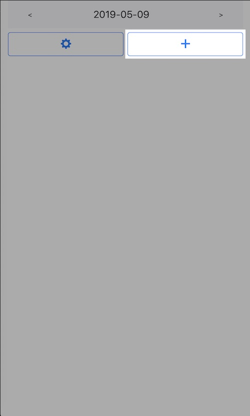

# Habit Tracker

## How to use it

### Step 1: Create a habit.

First, click the add button on the main screen.

Then, type the habit's name and the daily goal. Once you're done, click the "Save" button.

And, Here it is. You have successfully create your first habit!

